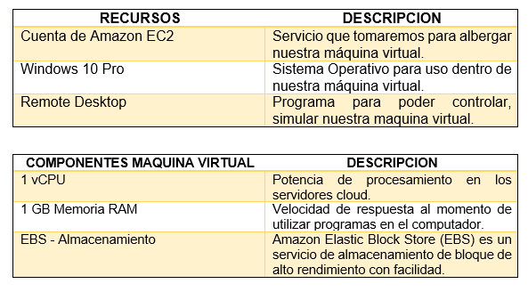
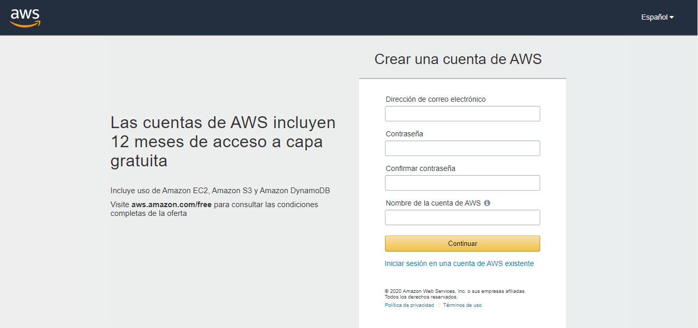

<H2>INFORME</H2>

<H3>1. PLANTEAMIENTO DEL PROBLEMA</H3>

El micro-ordenador Google Coral, entra al mercado ofreciendo ciertos atributos nuevos, los cuales potenciaran la inteligencia artificial para lo cual esta designado este dispositivo. Además, servirá no solo para la creación de nuevas cosas, también puede alimentar el cerebro de inteligencia artificial de dispositivos ya realizados. Coral no solo tiene capacidad para ejecutar redes neuronales en el propio RPI (Raspberry PI) tal cual le permitirá incorporar de manera rápida, eficaz todo aquello sobre inteligencia artificial, evitando el peligro de hacer publico los datos, es decir dándole confidencialidad a todos los datos que lo contiene.

TPU o Unidad de Procesamiento Tensorial, viene a ser un acelerador de Inteligencia Artificial el cual fue desarrollado por Google, con objetivo en el aprendizaje automático. Además, se usó en el procesamiento de texto de Street View viniendo a proporcionar resultados de búsqueda, en conclusión, TPU viene a acelerar ciertos procesos, unificarlos, procesarlos de mejor manera, siendo uno de los circuitos integrados más importantes.

Google Colab, entra como una de las tantas herramientas que posee Google, la cual permite ejecutar y programas en Python, mediante el navegador. Es útil ya que no requiere que se configure, ofrece acceso a GPUs de manera gratuita y se puede compartir los contenidos entre cuentas GOOGLE de manera simultánea. Colab también puede ser considerado como un notebook Jupyter pero de manera gratuita, además se debe tomar en cuenta que se almacena en la nube, mediante nuestras cuentas personales y su almacenamiento disponible. También permite el uso de varias bibliotecas de aprendizaje automático.

<H3>2. OBJETIVOS</H3>
<b>Objetivos Generales</b>

- Realizar un video explicando e identificando los temas relevantes a manera de un tutorial sobre el tema asignado.

- Conocer los beneficios de usar Google Coral y TPU, mediante Google Colab.

<b>Objetivos Específicos</b>

- Emplear las herramientas que nos brinda Google Coral y Colab.

- Analizar la plataforma Google Colab para el uso de TPU.

- Implementar un ejemplo que verifique la diferencia de rendimiento de una CPU y una TPU.

- Analizar las características de hardware y software de la tarjeta de desarrollo Google Coral.

<H3>3. ESTADO DEL ARTE</H3>
<b>Streaming de medios habilitados en la nube mediante Amazon Web Service (AWS)</b> 

Amazon Web Service (AWS) es una colección de servicios de computación remota formando una plataforma de computación en la nube, ofreciendo a través de Amazon.com. Los servicios más conocidos son Amazon EC2 y Amazon S3. En donde el servicio es mucho más rápido, escalable y económico siendo eficaz al generar una gran cantidad de servidores físicos.   
La transmisión de medios se realiza en computadoras y no en cualquier tipo de uso común. Por lo tanto, este sistema viene a ser, la clave para llevar la transmisión de medios a cada usuario que usa teléfonos inteligentes sin tener que preocuparse por la necesidad de Hardware.  
El objetivo principal de este sistema propuesto es la transmisión de archivos multimedia a través del servidor de medios utilizando el servicio de AWS. El servidor de medios utiliza Amazon EC2 para la transmisión, mientras que en el almacenamiento de archivos multimedia es hecho en EBS y Simple Storage Service (S3) el cual mantiene la copia de seguridad de estos archivos. Esta transmisión de datos a través de los web servidores de la nube hacia los que utilizan sistemas móviles en lugar de otros, presenta flexibilidad y rapidez al momento de visualizar.  
Esta flexibilidad se puede usar para abordar problemas importantes que enfrentan aplicaciones como el tráfico del monitoreo, conciertos en línea, conferencias, etc. Tomando en cuenta que una aplicación contara con varias personas en línea en el mismo instante, además de el Bit Rate que será ocupado en el servidor para que el usuario pueda tener una conexión estable con el medio.  

<b>Explorando la migración a la nube, en vivo, en Amazon EC2</b>

Los usuarios pueden migrar su máquina virtual de un proveedor de nube pública a otro, debido a un menor costo o falta de servicios que se necesiten. Actualmente no es posible instalar una segunda plataforma de virtualización en la nube pública porque la virtualización anidada y la virtualización asistida por hardware están deshabilitadas de forma predeterminada.  
Dando como resultado, la migración de máquinas virtuales a diferentes proveedores, mayoritariamente de pago, por los beneficios que les otorgan.  
Este artículo presenta LivCloud, una solución para vivir la migración a la nube. LivCloud está diseñado en criterios bien establecidos para migrar máquinas virtuales en vivo, con sus debidos protocolos de seguridad y permisos adecuados para tener absoluto control al momento de migrar.  
En este estudio, se evaluó la implementación del diseño básico de LivCloud en Amazon EC2. Esta instancia tiene de cálculo optimizado y procesadores de alto rendimiento. En particular se exploró tres opciones desarrolladas. Estas opciones están siendo probadas por primera vez en EC2 donde se podrá cambiar el valor que se tiene de control preestablecido a uno con mayores permisos, además cambiar los valores de los registros significativamente ayudara a habilitar la virtualización anidada en Amazon EC2.  
Es por esto y más, que los usuarios preferirían usar Amazon EC2 como su nube, para poder realizar tantos procesos como ellos los requieran, además facilitándoles la migración de su anterior servidor a este nuevo, de manera segura y rápido.  

<b>Aprovisionamiento y ejecución basados en costos de un servicio informático intensivo en el Amazon EC2</b>

La decisión de migrar un servicio a un sistema basado en la nube debe tener en cuenta muchos aspectos diferentes. Entre ellos, los costos económicos es uno de los más importantes. Este artículo describe cómo un servicio de esta calidad, basado en un enfoque de administrador de tareas, se ha migrado de una infraestructura de red a la infraestructura Amazon Elastic Compute Cloud (EC2).   
También se ha propuesto un modelo basado en costos para su evaluación a instancias económicas del servicio en la nube, donde se tomará en cuenta los costos informáticos, de almacenamiento y despliegue de la plataforma.   
El modelo incluye una amplia gama de diferentes tipos de instancias y políticas de compra proporcionadas por Amazon EC2, también respecto a costos esta propuesta se integra en el asunto para la implementación y ejecución del servicio, haciendo posible la interacción con los servicios web de Amazon para contratar los recursos en la nube necesarios y utilizarlos de manera eficiente para la ejecución del servicio, con esto el articulo trata de dar a entender los costos vienen a ser económicos referentes a la gran cantidad de beneficios que se obtiene contratando Amazon EC2.  

<H3>4. MARCO TEORICO</H3>

Google Coral, se desarrolló únicamente con el objetivo de realizar tareas de machine learning las cuales se integran en tareas de producción de manera eficaz y rápida. Hace uso de la red neuronal TensorFlow Lite y del modulo Edge TPU. Que es de tipo SOM (System on Module) donde van a estar ensamblados el procesador, la GPU, la RAM, el chip del WiFi y la Flash.

Coral trabaja para satisfacer las necesidades del cliente, por lo cual idearon dos productos a la venta los cuales son aceleradores y plazas de desarrollo para la creación de prototipos de nuevas ideas, y módulos para alimentar el cerebro de inteligencia artificial de los dispositivos de producción, tales como cámaras inteligentes y sensores.

Coral es capaz de ejecutar redes neurales en el propio RPI, de forma que “le es posible incorporar de manera rápida y eficaz, sin que sus proyectos representen un peligro para la confidencialidad de datos”.

Dentro de las especificaciones técnicas, son:

- CPU: NXP i.MXM 8M SOC (Cortex-A53 quad core)

- GPU: integrada, GC7000 Lite Graphics

- Coprocesador: Google Edge TPU

- RAM: 1 GB LPDDR4

- Almacenamiento: Flash eMMC de 8 GB

- Conectividad: WiFi 2×2 MIMO de doble banda y Bluetooth 4.1

- Dimensiones: 48 x 40 x 5 mm

Las especificaciones de la placa base son:

- Almacenamiento: microSD

- USB: Un USB C para funcionalidad OTG, un USB C para la alimentación, un USB de tip0o micro USB para consola y un puerto USB A

- LAN: puerto Gigabit Ethernet

- Audio: un conector mini jack de 3,5 mm y un terminal de 4 pines para altavoces estéreo

- Vídeo: Un conector HDMI 2.0a de tamaño completo y un conector de 24 pines para una cámara MIPI-CSI2

- GPIO: un conector de 40 pines

- Alimentación: 5 V Corriente continua

- Dimensiones: 88 x 60 x 24 mm

El módulo Edge TPU se ha diseñado para proporcionar un gran rendimiento en aplicaciones destinadas al aprendizaje automático, su tamaño compacto y reducido consumo de potencia lo hacen perfecto para ser integrado en sistemas dedicados al IoT, que realizan funciones de reconocimiento de imagen y de texto.

La incorporación de este chip a la Google Coral hace que se reduzca de manera exponencial el tiempo que requiere la red neuronal para procesar los datos que le son suministrados.

TensorFlow, se trata de una librería realizada en código abierto, la cual se ha desarrollado con un ecosistema de herramientas y una comunidad detrás de ella, cuyo único objetivo es potenciar el desarrollo de aplicaciones de Inteligencia Artificial y aprendizaje automático. Pero la novedad que presenta Google Coral, es que este pequeño micro PC es capaz de utilizarlo en tiempo real.

Google Colab, es una herramienta de Google, la cual trata de ser un entorno de maquinas virtuales basado en Jupyter Notebooks. Se pueden ejecutar en la nube, donde podremos escoger si correr en una CPU, GPU o en una TPU, todo esto de manera gratuita. No obstante, hay ciertas restricciones, como por ejemplo que una sesión dura 12 horas, pasado el tiempo se realiza una limpieza y se perderán ciertas variables, archivos que se deberán tener allí.

Sirve como medio para simular o experimentar con machine learning y Deep learning, pero sin tener que ir por costos de procesamiento de la nube, además el ambiente de trabajo ya tiene librerías instaladas las cuales están listas para utilizar, una de ellas antes mencionada es TensorFlow.

<H3>5. DIAGRAMAS</H3>

<H3>6. LISTA DE COMPONENTES</H3>

<H3>7. MAPA DE VARIABLES</H3>

La creación de una cuenta en <b>AWS</b> de tipo <b>ESTUDIANTIL</b> para el uso del servicio <b>AMAZON EC2</b>, viene a ser de tipo visual. Siendo la parte fundamental en la creación de nuestra máquina virtual, ya que sin ella no tendríamos acceso alguno a nuestro portal, y sin ser de tipo estudiantil no tendríamos ciertas funciones disponibles a menos que sea de pago.

<H3>8. EXPLICACION DEL CODIGO FUENTE</H3>

Nuestro proyecto no posee código fuente.

<H3>9. DESCRIPCION DE PRERREQUISITOS Y CONFIGURACION</H3>
<b>Aplicaciones Secundarias</b>

-	Control Remoto de Escritorio: Propiamente de la creación de Amazon EC2 para la reproducción visual de nuestra máquina virtual ya que en el sitio web solo poseemos la consola.

-	Navegador web (Google Chrome, Microsoft Edge): Tanto para la creación de la cuenta de usuario, como para la selección del sistema operativo a instalar.

<b>Configuración del terminal</b>

-	Se debe tener una cuenta ya sea ESTUDIANTIL o de PAGO para obtener ciertos beneficios a la hora de tener la máquina virtual, tanto en funciones como rapidez en transición de datos.

-	Ingresar el usuario y contraseña emitidos al correo electrónico para el uso únicamente de la máquina virtual mediante la aplicación secundaria.

-	Las MAQUINAS BASICAS tienen muy poco almacenamiento tanto en Disco Duro (30GB) como en Memoria RAM (1GB) es por ello que nos servirá únicamente para cosas muy sencillas.

-	El uso del control remoto de escritorio servirá para poder configurar de manera adecuada nuestra máquina virtual, como si tuviésemos una física.

<H3>10. APORTACIONES</H3>
<b>Máquina Virtual</b>

Es un software que simula un sistema de computación y puede ejecutar programas como si fuese una computadora real, pero lo hace de manera aislada además emula todos los elementos que posee una máquina en físico entre los componentes que simula se encuentran: disco duro, memoria RAM, tarjetas de red, tarjeta gráfica, etc.

<b>Sistema Operativo</b>

Es un conjunto de programas especialmente diseñado para hacer de intermediarios entre el usuario y la computadora, estos programas nos sirven para controlar el hardware de manera fácil y conveniente para el usuario, puede decirse que es corazón de la máquina ya que este tiene prioridad de ejecución ante otras aplicaciones además de controlar todos los periféricos disponibles en la computadora, los sistemas operativos más utilizados son: Microsoft Windows, Mac OS X y Linux Ubuntu.

<b>Tipos de Sistemas operativos</b>

- Sistema monoprocesador:  En el sistema monoprocesador existe una sola unidad de procesamiento central (CPU) capaz de ejecutar una serie de instrucciones de índole general.  
- Sistemas multiprocesadores: También llamados sistemas paralelos o estrechamente acoplados, los sistemas multiprocesadores tienen dos o más CPU que comparten buses y a veces el reloj, la memoria y los dispositivos periféricos. Los hay de dos tipos: 
• Multiprocesador asimétrico: cada procesador tiene una tarea específica. 
• Multiprocesadores simétricos: todos los procesadores realizan las mismas tareas.  
- Sistemas distribuidos: Un sistema distribuido presenta una colección de procesadores que no comparten memoria o reloj, y se comunican por una red interconectada.  
- Sistemas operativos de equipos portátiles: Los equipos portátiles de mano en este caso se refiere a aquellos dispositivos de pequeñas dimensiones que pueden ser manipulados con una mano, como por ejemplos las tabletas, los teléfonos inteligentes y las notebooks. Adicionalmente, los sistemas operativos de teléfonos deben adicionar componentes para las comunicaciones y la interface.  
- Sistemas operativos empotrados o en tiempo-real: Son los sistemas operativos instalados en los dispositivos médicos, electrónicos, electrodomésticos, automóviles, entre otros. Se encargan de tareas específicas del equipo en cuestión como: 
•	Ahorrar la potencia de la batería. 
•	Ajustarse a tiempos limitados. 
•	No requiere supervisión humana. 

<b>Parches de Seguridad</b>

Es un conjunto de cambios que se aplican a un software para corregir los errores o vulnerabilidades en programas o sistemas operativos, generalmente estos parches de seguridad (actualización de seguridad) son fabricados por fabricantes de software tras la detección de alguna vulnerabilidad y estos se instalan automáticamente o manualmente por el usuario.

<H3>11. CONCLUSIONES</H3>

Realizada la investigación sobre las tarjetas de desarrollo  se llegó a las conclusiones sobre los objetivos específicos las cuales fueron: 
-	Las TPU son dispositivos que realizan con una mayor velocidad ya que la misma trabaja con matrices y con bloques de código que en comparación de las CPU es un 30% a 40 % más  veloz y exacta en los cálculos. 
-	Las TPU son dispositivos que realizan con una mayor velocidad ya que la misma trabaja con matrices y con bloques de código que en comparación de las GPU es un 15% a 20 % más  veloz y exacta en los cálculos. 
-	El ejemplo funcional se especificó en pasos anteriores además de mostrar la diferencia de tiempos en la implementación del código en el CPU, GPU, TPU. 
Las conclusiones planteadas son de cada objetivo específico respectivamente los cuales ya fueron mostrados en un paso anterior. 
Después de llegar a la conclusión de cada uno de los objetivos específicos se tiene que llegar a la evolución final del objetivo principal, que después de la evaluación se llegó a su respectiva conclusión, la cual es: 
- Durante el desarrollo de los objetivos específicos se llegó a la conclusión que el objetivo general se cumplió a cabalidad ya  que gracias a la implementación del ejemplo mostrado anteriormente se mostró la diferencia en la velocidad de procesamiento que sus contrapartes como son las CPU y las GPU.

<H3>12. RECOMENDACIONES</H3>

-	Al momento de realizar la investigación nos mostró que se deben estudiar más afondo de la tecnología TPU ya que la misma al ser un concepto reciente no existe una información muy amplia.  
-	Conocer los distintos tipos de plataformas elegibles para realizar simulaciones sobre los diferentes elementos estudiados en este artículo.  
- Tener en cuenta al momento de realizar cualquier simulación en las TPU , GPU y las CPU se deben tomar en cuenta los lenguajes de programación elegidos para el componente en el que se necesita simularlo. 

<H3>13. CRONOGRAMA</H3>

<H3>14. BIBLIOGRAFIA</H3>

-	https://www.adslzone.net/2017/04/06/tpu-el-chip-de-google-hasta-30-veces-mas-potente-que-una-cpu-y-gpu-normales/J.  Clerk  Maxwell, A Treatise on Electricity and Magnetism, 3rd ed., vol. 2. Oxford: Clarendon, 1892, pp.68-73.  
-	I.S.  Jacobs  and  C.P.  Bean,  “Fine  particles,  thin films  and  exchange  anisotropy,”  in  Magnetism, vol. III, G.T. Rado and H. Suhl, Eds. New York: Academic, 1963, pp. 271-350.  
- K. Elissa, “Title of paper if known,” unpublished.  
- https://es.wikipedia.org/wiki/Unidad_central_de_procesamiento.  
-	https://www.definicionabc.com/tecnologia/cpu.php.  
- http://www.valortop.com/blog/que-es-la-cpu-o-procesador-de-un-ordenador.  
-	https://cloud.google.com/blog/big-data/2017/05/an-in-depth-look-at-googles-first-tensor-processing-unit-tpu.  
-	https://es.wikipedia.org/wiki/Unidad_de_procesamiento_de_tensor.  
-	https://www.adslzone.net/2017/04/06/tpu-el-chip-de-google-hasta-30-veces-mas-potente-que-una-cpu-y-gpu-normales/  
-	https://www.blog.google/topics/google-cloud/google-cloud-offer-tpus-machine-learning/  
-	https://www.nextplatform.com/2017/05/17/first-depth-look-googles-new-secondgeneration-tpu/  
-	http://www.informatica-hoy.com.ar/aprender-informatica/Diferencias-CPU-GPU-APU.php  
-	https://www.hpcwire.com/2017/04/10/nvidia-responds-google-tpu-benchmarking/  
-	http://www.forosdeelectronica.com/f37/procesadores-dedicados-redes-neurologicas-procesamiento-tensores-152755/  

<H3>15. ANEXOS</H3>
<H3>15.1 MANUAL DE USUARIO</H3>
<H3>15.2 HOJAS TECNICAS</H3>

Nuestro proyecto no posee hojas técnicas.

