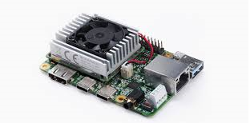
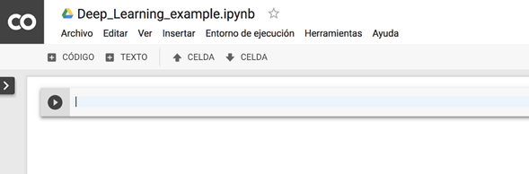
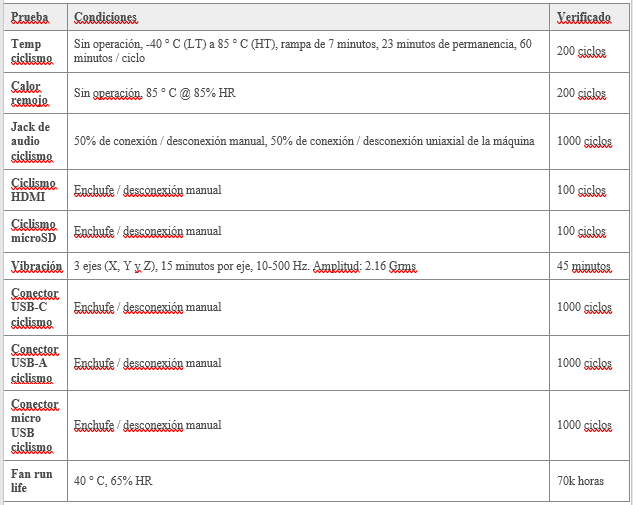
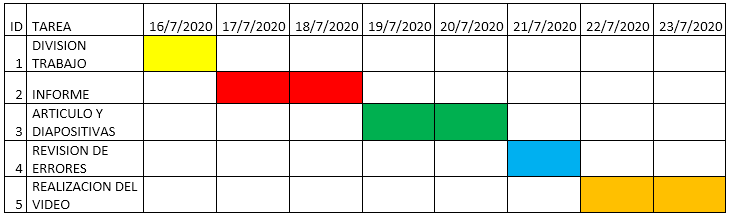

<H2>INFORME</H2>

<H3>1. PLANTEAMIENTO DEL PROBLEMA</H3>

El micro-ordenador Google Coral, entra al mercado ofreciendo ciertos atributos nuevos, los cuales potenciaran la inteligencia artificial para lo cual esta designado este dispositivo. Además, servirá no solo para la creación de nuevas cosas, también puede alimentar el cerebro de inteligencia artificial de dispositivos ya realizados. Coral no solo tiene capacidad para ejecutar redes neuronales en el propio RPI (Raspberry PI) tal cual le permitirá incorporar de manera rápida, eficaz todo aquello sobre inteligencia artificial, evitando el peligro de hacer publico los datos, es decir dándole confidencialidad a todos los datos que lo contiene.

TPU o Unidad de Procesamiento Tensorial, viene a ser un acelerador de Inteligencia Artificial el cual fue desarrollado por Google, con objetivo en el aprendizaje automático. Además, se usó en el procesamiento de texto de Street View viniendo a proporcionar resultados de búsqueda, en conclusión, TPU viene a acelerar ciertos procesos, unificarlos, procesarlos de mejor manera, siendo uno de los circuitos integrados más importantes.

Google Colab, entra como una de las tantas herramientas que posee Google, la cual permite ejecutar y programas en Python, mediante el navegador. Es útil ya que no requiere que se configure, ofrece acceso a GPUs de manera gratuita y se puede compartir los contenidos entre cuentas GOOGLE de manera simultánea. Colab también puede ser considerado como un notebook Jupyter pero de manera gratuita, además se debe tomar en cuenta que se almacena en la nube, mediante nuestras cuentas personales y su almacenamiento disponible. También permite el uso de varias bibliotecas de aprendizaje automático.

<H3>2. OBJETIVOS</H3>
<b>Objetivos Generales</b>

- Realizar un video explicando e identificando los temas relevantes a manera de un tutorial sobre el tema asignado.

- Conocer los beneficios de usar Google Coral y TPU, mediante Google Colab.

<b>Objetivos Específicos</b>

- Emplear las herramientas que nos brinda Google Coral y Colab.

- Analizar la plataforma Google Colab para el uso de TPU.

- Implementar un ejemplo que verifique la diferencia de rendimiento de una CPU y una TPU.

- Analizar las características de hardware y software de la tarjeta de desarrollo Google Coral.

<H3>3. ESTADO DEL ARTE</H3>
<b>Notas sobre el uso de Google Colaboratory en la educación de Inteligencia Artificial</b> 

Un desafío en el diseño de cursos de inteligencia artificial moderna es elegir herramientas y marcos apropiados para ejemplos en clase y tareas. No sólo es importante que las herramientas sean capaces de cubrir la profundidad del material presentado en el curso, sino lo suficientemente simple como para que los instructores lo implementen en el aula y que los estudiantes mantengan el enfoque en el plan de estudios.   
Los cuadernos de Jupyter es decir, documentos interactivos entrelazados con texto y código, son una herramienta cada vez más popular para que los investigadores lleven a cabo y comuniquen los resultados de la investigación, pero lo suficientemente simples como para desarrollar ejemplos en el aula y tareas.  
Sin embargo, estos portátiles todavía requieren hardware sofisticado para ejecutar muchos de los enfoques populares en la IA hoy en día. Ofrecido como un servicio gratuito de Google, Colaboratory proporciona una interfaz Jupyter Notebook con acceso al hardware de Google. Los blocs de notas se ejecutan en máquinas virtuales basadas en Linux proporcionadas y mantenidas por Google, donde el cálculo se puede realizar con unidades de procesamiento central como lo es el CPU o acelerarse a través de unidades de procesamiento gráfico especializadas como la GPU y unidades de procesamiento de tensores como la TPU.  

- Fuente: Notes on Using Google Colaboratory in AI Education | Proceedings of the 2020 ACM Conference on Innovation and Technology in Computer Science Education. (n.d.). Recuperado en Julio 23, 2020, de https://dl.acm.org/doi/abs/10.1145/3341525.3393997

<b>Consultas relacionales con una unidad de procesamiento de tensor</b>

Los procesadores de uso general han alcanzado una meta con respecto a la densidad de integración y las velocidades de reloj. Al mismo tiempo, las innovaciones en los sistemas han eliminado las ineficiencias en gran medida.  
Un enfoque común es el reusar el hardware que está disponible en grandes cantidades a bajo costo, más prominentemente las Unidades de Procesamiento de Gráficos en este caso la GPU. La desventaja aquí es que el diseño de esos dispositivos fue desarrollado para un caso de uso muy diferente, juegos de ordenador 3D, y sólo benefician en parte el caso de uso de procesamiento de datos.  
La eficiencia en esas tareas se logra con memoria de gran ancho de banda y paralelismo masivo de computación.  

- Fuente: Relational Queries with a Tensor Processing Unit | Proceedings of the 15th International Workshop on Data Management on New Hardware. (n.d.). Recuperado en Julio 23, 2020, de https://dl.acm.org/doi/abs/10.1145/3329785.3329932

<b>Mejorar la eficiencia energética y la resiliencia de errores de una unidad de procesamiento de tensor de umbral cercano</b>

Los avances en inteligencia artificial han entrado en un nuevo reino debido al desarrollo de arquitecturas específicas de dominio dedicadas al procesamiento de redes neuronales.   
Tensor Processing Unit (TPU), un circuito integrado específico de aplicaciones personalizadas creado por Google, es uno de estos aceleradores.  
El rápido aumento de las cargas de trabajo exige un aumento de la velocidad de procesamiento y el volumen de implementación. Sin embargo, tiene un costo de un uso intensivo de energía, afectando así la eficiencia energética del sistema.   
Los aceleradores como las TPU están diseñados para ofrecer un rendimiento muy alto para cargas de trabajo de inferencia de DNN. Aunque las condiciones de funcionamiento de NTC pueden garantizar un bajo consumo de energía, el rendimiento se reduce en gran medida debido a los transistores más lentos y los retrasos computacionales más largos.  

- EFFORT: Enhancing Energy Efficiency and Error Resilience of a Near-Threshold Tensor Processing Unit - IEEE Conference Publication. (n.d.). Recuperado en Julio 28, 2020, de https://ieeexplore.ieee.org/abstract/document/9045479

<H3>4. MARCO TEORICO</H3>

Google Coral, se desarrolló únicamente con el objetivo de realizar tareas de machine learning las cuales se integran en tareas de producción de manera eficaz y rápida. Hace uso de la red neuronal TensorFlow Lite y del modulo Edge TPU. Que es de tipo SOM (System on Module) donde van a estar ensamblados el procesador, la GPU, la RAM, el chip del WiFi y la Flash.

Coral trabaja para satisfacer las necesidades del cliente, por lo cual idearon dos productos a la venta los cuales son aceleradores y plazas de desarrollo para la creación de prototipos de nuevas ideas, y módulos para alimentar el cerebro de inteligencia artificial de los dispositivos de producción, tales como cámaras inteligentes y sensores.

Coral es capaz de ejecutar redes neurales en el propio RPI, de forma que “le es posible incorporar de manera rápida y eficaz, sin que sus proyectos representen un peligro para la confidencialidad de datos”.

Dentro de las especificaciones técnicas, son:

- CPU: NXP i.MXM 8M SOC (Cortex-A53 quad core)

- GPU: integrada, GC7000 Lite Graphics

- Coprocesador: Google Edge TPU

- RAM: 1 GB LPDDR4

- Almacenamiento: Flash eMMC de 8 GB

- Conectividad: WiFi 2×2 MIMO de doble banda y Bluetooth 4.1

- Dimensiones: 48 x 40 x 5 mm

Las especificaciones de la placa base son:

- Almacenamiento: microSD

- USB: Un USB C para funcionalidad OTG, un USB C para la alimentación, un USB de tip0o micro USB para consola y un puerto USB A

- LAN: puerto Gigabit Ethernet

- Audio: un conector mini jack de 3,5 mm y un terminal de 4 pines para altavoces estéreo

- Vídeo: Un conector HDMI 2.0a de tamaño completo y un conector de 24 pines para una cámara MIPI-CSI2

- GPIO: un conector de 40 pines

- Alimentación: 5 V Corriente continua

- Dimensiones: 88 x 60 x 24 mm

El módulo Edge TPU se ha diseñado para proporcionar un gran rendimiento en aplicaciones destinadas al aprendizaje automático, su tamaño compacto y reducido consumo de potencia lo hacen perfecto para ser integrado en sistemas dedicados al IoT, que realizan funciones de reconocimiento de imagen y de texto.

La incorporación de este chip a la Google Coral hace que se reduzca de manera exponencial el tiempo que requiere la red neuronal para procesar los datos que le son suministrados.

TensorFlow, se trata de una librería realizada en código abierto, la cual se ha desarrollado con un ecosistema de herramientas y una comunidad detrás de ella, cuyo único objetivo es potenciar el desarrollo de aplicaciones de Inteligencia Artificial y aprendizaje automático. Pero la novedad que presenta Google Coral, es que este pequeño micro PC es capaz de utilizarlo en tiempo real.

Google Colab, es una herramienta de Google, la cual trata de ser un entorno de maquinas virtuales basado en Jupyter Notebooks. Se pueden ejecutar en la nube, donde podremos escoger si correr en una CPU, GPU o en una TPU, todo esto de manera gratuita. No obstante, hay ciertas restricciones, como por ejemplo que una sesión dura 12 horas, pasado el tiempo se realiza una limpieza y se perderán ciertas variables, archivos que se deberán tener allí.

Sirve como medio para simular o experimentar con machine learning y Deep learning, pero sin tener que ir por costos de procesamiento de la nube, además el ambiente de trabajo ya tiene librerías instaladas las cuales están listas para utilizar, una de ellas antes mencionada es TensorFlow.

<H3>5. DIAGRAMAS</H3>

<H3>6. LISTA DE COMPONENTES</H3>

<b>Google Coral</b>

- Edge TPU System-on-Module (SoM) 
- SoC NXP i.MX 8M (brazo de cuatro núcleos Cortex-A53, más Cortex-M4F) 
- Coprocesador acelerador Google Edge TPU ML 
- Coprocesador criptográfico 
- Wi-Fi 2x2 MIMO (802.11b / g / n / ac 2.4 / 5 GHz) 
- Bluetooth 4.2 
- EMMC de 8 GB 
- 1 GB LPDDR4 
- Conexiones USB 
- Puerto de alimentación USB tipo C (5 V CC) 
- Puerto USB 3.0 Tipo-C OTG 
- Puerto host USB 3.0 tipo A 
- Puerto de consola serie USB 2.0 Micro-B 
- Conexiones de audio 
- Conector de audio de 3,5 mm (compatible con CTIA) 
- Micrófono digital PDM (x2) 
- Terminal de 4 pines de 2,54 mm para altavoces estéreo 
- Conexiones de video 
- HDMI 2.0a (tamaño completo) 
- Conector FFC de 39 pines para pantalla MIPI DSI (4 carriles) 
- Conector FFC de 24 pines para cámara MIPI CSI-2 (4 carriles) 
- Ranura para tarjeta microSD 
- Puerto Gigabit Ethernet 
- Cabecera de expansión GPIO de 40 pines 
- Admite Mendel Linux (derivado de Debian) 

<b>Google Colab</b>

- IPython Notebook 
- Celdas 
- Kernel 
- Librerías 
- VM de Google Compute Engine (la infraestructura de máquinas virtuales de Google en la nube) 
- 12 GB de RAM 
- 50 GB de almancenamiento en disco disponibles para el uso 
- Tiempo-Maximo 12 horas 
- Python 2 
- Python 3 
- GPU 
- CPU 
- TPU 

<H3>7. MAPA DE VARIABLES</H3>

<H3>8. EXPLICACION DEL CODIGO FUENTE</H3>

Nuestro proyecto no posee código fuente.

<H3>9. DESCRIPCION DE PRERREQUISITOS Y CONFIGURACION</H3>

Se necesita una cuenta de Google colab donde nosotros podremos guardar nuestros códigos y permitir que nuestros compañeros puedan acceder y modificar nuestros diferentes códigos, la cual puede ser una cuenta institucional o una cuenta personal donde solo debemos llenar nuestra información y posteriormente elegir nuestro tipo de código que queremos realizar (Python 2 o Python3) nuestro tipo de procesador que queramos (CPU, GPU o TPU) y listo ya podemos usar Google colab al 100%

<H3>10. APORTACIONES</H3>
<b>SOM</b>

Coral System-on-Module (SoM) es un sistema completamente integrado que lo ayuda a construir dispositivos integrados que exigen inferencias de aprendizaje automático (ML) rápidas. Contiene el sistema en chip (SoC) iMX 8M de NXP, memoria eMMC, LPDDR4 RAM, Wi-Fi y Bluetooth, pero su potencia única proviene del coprocesador Edge TPU de Google para la inferencia de aprendizaje automático de alta velocidad. (Google Coral, 2019)

<b>Edge TPU</b>

Edge TPU permite desplegar inferencias de aprendizaje automático de alta calidad en el perímetro por medio de diversos productos de producción y prototipado de Coral.

La plataforma de aprendizaje automático en el perímetro de Coral refuerza las TPU de Google Cloud y Cloud IoT para proporcionar una infraestructura completa (de hardware y software, y de la nube al perímetro) que facilita el despliegue de las soluciones basadas en IA de los clientes. La plataforma de Coral no solo incluye el entorno de programación de código abierto TensorFlow Lite, sino que también proporciona un kit de herramientas para desarrolladores que te permite compilar tus propios modelos o volver a preparar varios modelos de IA de Google para Edge TPU. De esta manera, se aúnan nuestros conocimientos avanzados tanto en IA como en hardware. (Merino, 2019)

Edge TPU complementa las CPU, GPU y FPGA, además de otras soluciones ASIC, a fin de ejecutar la IA en el perímetro.

<b>Python</b>

Python es un lenguaje de programación interpretado cuya filosofía hace hincapié en la legibilidad de su código. Se trata de un lenguaje de programación multiparadigma, ya que soporta orientación a objetos, programación imperativa y, en menor medida, programación funcional. Es un lenguaje interpretado, dinámico y multiplataforma.Es administrado por la Python Software Foundation. Posee una licencia de código abierto, denominada Python Software Foundation License, que es compatible con la Licencia pública general de GNU a partir de la versión 2.1.1, e incompatible en ciertas versiones anteriores(Knowlton, Jim (2009)).

<b>Edge Computing</b>

El edge computing es un tipo de informática que ocurre en la ubicación física del usuario, de la fuente de datos, o cerca de ellas. Al establecer servicios de computación cerca de esas ubicaciones, los usuarios obtienen servicios más rápidos y confiables, y las empresas aprovechan la flexibilidad del cloud computing híbrido. Con el edge computing, una empresa puede usar y distribuir un conjunto común de recursos en una gran cantidad de ubicaciones. (Merino, 2019)

<H3>11. CONCLUSIONES</H3>

Realizada la investigación sobre las tarjetas de desarrollo  se llegó a las conclusiones sobre los objetivos específicos las cuales fueron: 
-	Las TPU son dispositivos que realizan con una mayor velocidad ya que la misma trabaja con matrices y con bloques de código que en comparación de las CPU es un 30% a 40 % más  veloz y exacta en los cálculos. 
-	Las TPU son dispositivos que realizan con una mayor velocidad ya que la misma trabaja con matrices y con bloques de código que en comparación de las GPU es un 15% a 20 % más  veloz y exacta en los cálculos. 
-	El ejemplo funcional se especificó en pasos anteriores además de mostrar la diferencia de tiempos en la implementación del código en el CPU, GPU, TPU.  
Las conclusiones planteadas son de cada objetivo específico respectivamente los cuales ya fueron mostrados en un paso anterior. 
Después de llegar a la conclusión de cada uno de los objetivos específicos se tiene que llegar a la evolución final del objetivo principal, que después de la evaluación se llegó a su respectiva conclusión, la cual es: 
- Durante el desarrollo de los objetivos específicos se llegó a la conclusión que el objetivo general se cumplió a cabalidad ya  que gracias a la implementación del ejemplo mostrado anteriormente se mostró la diferencia en la velocidad de procesamiento que sus contrapartes como son las CPU y las GPU.

<H3>12. RECOMENDACIONES</H3>

-	Al momento de realizar la investigación nos mostró que se deben estudiar más afondo de la tecnología TPU ya que la misma al ser un concepto reciente no existe una información muy amplia.  
-	Conocer los distintos tipos de plataformas elegibles para realizar simulaciones sobre los diferentes elementos estudiados en este artículo.  
- Tener en cuenta al momento de realizar cualquier simulación en las TPU , GPU y las CPU se deben tomar en cuenta los lenguajes de programación elegidos para el componente en el que se necesita simularlo. 

<H3>13. CRONOGRAMA</H3>

<H3>14. BIBLIOGRAFIA</H3>

-	https://www.adslzone.net/2017/04/06/tpu-el-chip-de-google-hasta-30-veces-mas-potente-que-una-cpu-y-gpu-normales/J.  Clerk  Maxwell, A Treatise on Electricity and Magnetism, 3rd ed., vol. 2. Oxford: Clarendon, 1892, pp.68-73.  
-	I.S.  Jacobs  and  C.P.  Bean,  “Fine  particles,  thin films  and  exchange  anisotropy,”  in  Magnetism, vol. III, G.T. Rado and H. Suhl, Eds. New York: Academic, 1963, pp. 271-350.  
- K. Elissa, “Title of paper if known,” unpublished.  
- https://es.wikipedia.org/wiki/Unidad_central_de_procesamiento.  
-	https://www.definicionabc.com/tecnologia/cpu.php.  
- http://www.valortop.com/blog/que-es-la-cpu-o-procesador-de-un-ordenador.  
-	https://cloud.google.com/blog/big-data/2017/05/an-in-depth-look-at-googles-first-tensor-processing-unit-tpu.  
-	https://es.wikipedia.org/wiki/Unidad_de_procesamiento_de_tensor.  
-	https://www.adslzone.net/2017/04/06/tpu-el-chip-de-google-hasta-30-veces-mas-potente-que-una-cpu-y-gpu-normales/  
-	https://www.blog.google/topics/google-cloud/google-cloud-offer-tpus-machine-learning/  
-	https://www.nextplatform.com/2017/05/17/first-depth-look-googles-new-secondgeneration-tpu/  
-	http://www.informatica-hoy.com.ar/aprender-informatica/Diferencias-CPU-GPU-APU.php  
-	https://www.hpcwire.com/2017/04/10/nvidia-responds-google-tpu-benchmarking/  
-	http://www.forosdeelectronica.com/f37/procesadores-dedicados-redes-neurologicas-procesamiento-tensores-152755/  

<H3>15. ANEXOS</H3>
<H3>15.1 MANUAL DE USUARIO</H3>

Adjunto en la carpeta Manual de Usuario.

<H3>15.2 HOJAS TECNICAS</H3>

Adjunto en la carpeta Hojas Técnicas.

