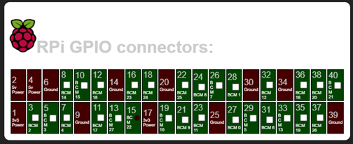
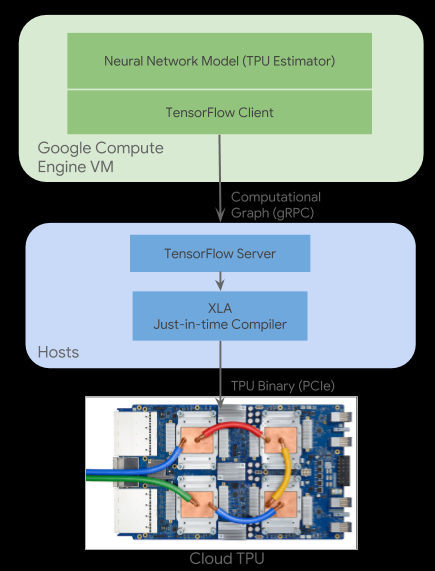
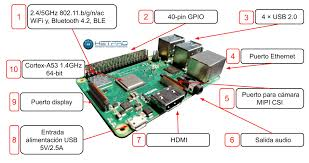
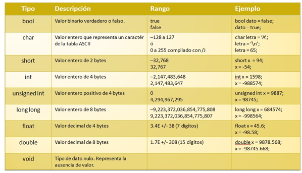

<H2>INFORME</H2>

<H3>1. PLANTEAMIENTO DEL PROBLEMA</H3>

El micro-ordenador Google Coral, entra al mercado ofreciendo ciertos atributos nuevos, los cuales potenciaran la inteligencia artificial para lo cual esta designado este dispositivo. Además, servirá no solo para la creación de nuevas cosas, también puede alimentar el cerebro de inteligencia artificial de dispositivos ya realizados. Coral no solo tiene capacidad para ejecutar redes neuronales en el propio RPI (Raspberry PI) tal cual le permitirá incorporar de manera rápida, eficaz todo aquello sobre inteligencia artificial, evitando el peligro de hacer publico los datos, es decir dándole confidencialidad a todos los datos que lo contiene.

TPU o Unidad de Procesamiento Tensorial, viene a ser un acelerador de Inteligencia Artificial el cual fue desarrollado por Google, con objetivo en el aprendizaje automático. Además, se usó en el procesamiento de texto de Street View viniendo a proporcionar resultados de búsqueda, en conclusión, TPU viene a acelerar ciertos procesos, unificarlos, procesarlos de mejor manera, siendo uno de los circuitos integrados más importantes.

Google Colab, entra como una de las tantas herramientas que posee Google, la cual permite ejecutar y programas en Python, mediante el navegador. Es útil ya que no requiere que se configure, ofrece acceso a GPUs de manera gratuita y se puede compartir los contenidos entre cuentas GOOGLE de manera simultánea. Colab también puede ser considerado como un notebook Jupyter pero de manera gratuita, además se debe tomar en cuenta que se almacena en la nube, mediante nuestras cuentas personales y su almacenamiento disponible. También permite el uso de varias bibliotecas de aprendizaje automático.

<H3>2. OBJETIVOS</H3>
<b>Objetivos Generales</b>

- Realizar un video explicando e identificando los temas relevantes a manera de un tutorial sobre el tema asignado.

- Conocer los beneficios de usar Google Coral y TPU, mediante Google Colab.

<b>Objetivos Específicos</b>

- Emplear las herramientas que nos brinda Google Coral y Colab.

- Analizar la plataforma Google Colab para el uso de TPU.

- Implementar un ejemplo que verifique la diferencia de rendimiento de una CPU y una TPU.

- Analizar las características de hardware y software de la tarjeta de desarrollo Google Coral.

<H3>3. ESTADO DEL ARTE</H3>
<b>Notas sobre el uso de Google Colaboratory en la educación de Inteligencia Artificial</b> 

Un desafío en el diseño de cursos de inteligencia artificial moderna es elegir herramientas y marcos apropiados para ejemplos en clase y tareas. No sólo es importante que las herramientas sean capaces de cubrir la profundidad del material presentado en el curso, sino lo suficientemente simple como para que los instructores lo implementen en el aula y que los estudiantes mantengan el enfoque en el plan de estudios.   
Los cuadernos de Jupyter es decir, documentos interactivos entrelazados con texto y código, son una herramienta cada vez más popular para que los investigadores lleven a cabo y comuniquen los resultados de la investigación, pero lo suficientemente simples como para desarrollar ejemplos en el aula y tareas.  
Sin embargo, estos portátiles todavía requieren hardware sofisticado para ejecutar muchos de los enfoques populares en la IA hoy en día. Ofrecido como un servicio gratuito de Google, Colaboratory proporciona una interfaz Jupyter Notebook con acceso al hardware de Google. Los blocs de notas se ejecutan en máquinas virtuales basadas en Linux proporcionadas y mantenidas por Google, donde el cálculo se puede realizar con unidades de procesamiento central como lo es el CPU o acelerarse a través de unidades de procesamiento gráfico especializadas como la GPU y unidades de procesamiento de tensores como la TPU.  

- Fuente: Notes on Using Google Colaboratory in AI Education | Proceedings of the 2020 ACM Conference on Innovation and Technology in Computer Science Education. (n.d.). Recuperado en Julio 23, 2020, de https://dl.acm.org/doi/abs/10.1145/3341525.3393997

<b>Consultas relacionales con una unidad de procesamiento de tensor</b>

Los procesadores de uso general han alcanzado una meta con respecto a la densidad de integración y las velocidades de reloj. Al mismo tiempo, las innovaciones en los sistemas han eliminado las ineficiencias en gran medida.  
Un enfoque común es el reusar el hardware que está disponible en grandes cantidades a bajo costo, más prominentemente las Unidades de Procesamiento de Gráficos en este caso la GPU. La desventaja aquí es que el diseño de esos dispositivos fue desarrollado para un caso de uso muy diferente, juegos de ordenador 3D, y sólo benefician en parte el caso de uso de procesamiento de datos.  
La eficiencia en esas tareas se logra con memoria de gran ancho de banda y paralelismo masivo de computación.  

- Fuente: Relational Queries with a Tensor Processing Unit | Proceedings of the 15th International Workshop on Data Management on New Hardware. (n.d.). Recuperado en Julio 23, 2020, de https://dl.acm.org/doi/abs/10.1145/3329785.3329932

<b>Mejorar la eficiencia energética y la resiliencia de errores de una unidad de procesamiento de tensor de umbral cercano</b>

Los avances en inteligencia artificial han entrado en un nuevo reino debido al desarrollo de arquitecturas específicas de dominio dedicadas al procesamiento de redes neuronales.   
Tensor Processing Unit (TPU), un circuito integrado específico de aplicaciones personalizadas creado por Google, es uno de estos aceleradores.  
El rápido aumento de las cargas de trabajo exige un aumento de la velocidad de procesamiento y el volumen de implementación. Sin embargo, tiene un costo de un uso intensivo de energía, afectando así la eficiencia energética del sistema.   
Los aceleradores como las TPU están diseñados para ofrecer un rendimiento muy alto para cargas de trabajo de inferencia de DNN. Aunque las condiciones de funcionamiento de NTC pueden garantizar un bajo consumo de energía, el rendimiento se reduce en gran medida debido a los transistores más lentos y los retrasos computacionales más largos.  

- Fuente: Enhancing Energy Efficiency and Error Resilience of a Near-Threshold Tensor Processing Unit - IEEE Conference Publication. (n.d.). Recuperado en Julio 28, 2020, de https://ieeexplore.ieee.org/abstract/document/9045479

<H3>4. MARCO TEORICO</H3>

Google Coral, se desarrolló únicamente con el objetivo de realizar tareas de machine learning las cuales se integran en tareas de producción de manera eficaz y rápida. Hace uso de la red neuronal TensorFlow Lite y del modulo Edge TPU. Que es de tipo SOM (System on Module) donde van a estar ensamblados el procesador, la GPU, la RAM, el chip del WiFi y la Flash.

Coral trabaja para satisfacer las necesidades del cliente, por lo cual idearon dos productos a la venta los cuales son aceleradores y plazas de desarrollo para la creación de prototipos de nuevas ideas, y módulos para alimentar el cerebro de inteligencia artificial de los dispositivos de producción, tales como cámaras inteligentes y sensores.

Coral es capaz de ejecutar redes neurales en el propio RPI, de forma que “le es posible incorporar de manera rápida y eficaz, sin que sus proyectos representen un peligro para la confidencialidad de datos”.

Dentro de las especificaciones técnicas, son:

- CPU: NXP i.MXM 8M SOC (Cortex-A53 quad core)

- GPU: integrada, GC7000 Lite Graphics

- Coprocesador: Google Edge TPU

- RAM: 1 GB LPDDR4

- Almacenamiento: Flash eMMC de 8 GB

- Conectividad: WiFi 2×2 MIMO de doble banda y Bluetooth 4.1

- Dimensiones: 48 x 40 x 5 mm

Las especificaciones de la placa base son:

- Almacenamiento: microSD

- USB: Un USB C para funcionalidad OTG, un USB C para la alimentación, un USB de tip0o micro USB para consola y un puerto USB A

- LAN: puerto Gigabit Ethernet

- Audio: un conector mini jack de 3,5 mm y un terminal de 4 pines para altavoces estéreo

- Vídeo: Un conector HDMI 2.0a de tamaño completo y un conector de 24 pines para una cámara MIPI-CSI2

- GPIO: un conector de 40 pines

- Alimentación: 5 V Corriente continua

- Dimensiones: 88 x 60 x 24 mm

El módulo Edge TPU se ha diseñado para proporcionar un gran rendimiento en aplicaciones destinadas al aprendizaje automático, su tamaño compacto y reducido consumo de potencia lo hacen perfecto para ser integrado en sistemas dedicados al IoT, que realizan funciones de reconocimiento de imagen y de texto.

La incorporación de este chip a la Google Coral hace que se reduzca de manera exponencial el tiempo que requiere la red neuronal para procesar los datos que le son suministrados.

TensorFlow, se trata de una librería realizada en código abierto, la cual se ha desarrollado con un ecosistema de herramientas y una comunidad detrás de ella, cuyo único objetivo es potenciar el desarrollo de aplicaciones de Inteligencia Artificial y aprendizaje automático. Pero la novedad que presenta Google Coral, es que este pequeño micro PC es capaz de utilizarlo en tiempo real.

Google Colab, es una herramienta de Google, la cual trata de ser un entorno de maquinas virtuales basado en Jupyter Notebooks. Se pueden ejecutar en la nube, donde podremos escoger si correr en una CPU, GPU o en una TPU, todo esto de manera gratuita. No obstante, hay ciertas restricciones, como por ejemplo que una sesión dura 12 horas, pasado el tiempo se realiza una limpieza y se perderán ciertas variables, archivos que se deberán tener allí.

Sirve como medio para simular o experimentar con machine learning y Deep learning, pero sin tener que ir por costos de procesamiento de la nube, además el ambiente de trabajo ya tiene librerías instaladas las cuales están listas para utilizar, una de ellas antes mencionada es TensorFlow.

<H3>5. DIAGRAMAS</H3>

<H3>6. LISTA DE COMPONENTES</H3>

<b>Raspberry pi</b>

CPU + GPU: Broadcom BCM2837B0, Cortex-A53 (ARMv8) 64-bit SoC @ 1.4GHz

RAM: 1GB LPDDR2 SDRAM

Wi-Fi + Bluetooth: 2.4GHz y 5GHz IEEE 802.11.b/g/n/ac, Bluetooth 4.2, BLE

Ethernet: Gigabit Ethernet sobre USB 2.0 (300 Mbps)

GPIO de 40 pines

HDMI

4 puertos USB 2.0

Puerto CSI para conectar una cámara.

Puerto DSI para conectar una pantalla táctil

Salida de audio estéreo y vídeo compuesto

Micro-SD

Power-over-Ethernet (PoE)

<b>Python</b>

Python es un lenguaje de programación interpretado cuya filosofía hace hincapié en la legibilidad de su código. Se trata de un lenguaje de programación multiparadigma, ya que soporta orientación a objetos, programación imperativa y, en menor medida, programación funcional. Es un lenguaje interpretado, dinámico y multiplataforma.(Documentation, 2020)

Es administrado por la Python Software Foundation. Posee una licencia de código abierto, denominada Python Software Foundation License,

<H3>7. MAPA DE VARIABLES</H3>

<H3>8. EXPLICACION DEL CODIGO FUENTE</H3>
<b>
Alarma de incendios.
</b>
import RPi.GPIO as GPIO

import time

GPIO.setmode(GPIO.BOARD)

GPIO.setup(40, GPIO.OUT)

class Alarma:

  i=0

  gass=0

  h=0

  tema=0

  temb=0

  
  def menu(self):

    print("\nIndicaciones")

    print("8) Sensor de gas")

    print("10) Sensor de humo")

    print("12) Temperatura 45")

    print("11) Temperatura 60")

  
  def gas(self):

    gass=0

    if GPIO.input(8) == GPIO.HIGH:

      gass=1

    return gass

  def humo(self):

    h=0

    if GPIO.input(10) == GPIO.HIGH:

      h=1

    return h

  def tem45(self):

    tema=0

    if GPIO.input(12) == GPIO.HIGH:

      tema=1

    return tema

  def tem60(self):

    temb=0

    if GPIO.input(11) == GPIO.HIGH:

      temb=1

    return temb

  def incendio(self,gass,h,tema,temb):

    i = temb + gass*tema + gass*h + tema*h

    return i

  
  def imprimir(self,a):

    print("\n\nSE INENDIA, AUXILIO¡¡")

    print("\n\nApagar Alarma pin 37")

    print("Primero desactive los anteriores pins")

   
  def foco(self):

    while (GPIO.input(37) != GPIO.HIGH):

      GPIO.output(40, True)

      time.sleep(0.5)

      GPIO.output(40, False)

      time.sleep(0.5)

     
t=1  
  

alam=Alarma()

alam.menu()

while (t!=0):

  gas=alam.gas()

  humo=alam.humo()

  tem45=alam.tem45()

  tem60=alam.tem60()

  si=alam.incendio(gas,humo,tem45,tem60)

  if si >= 1:

    alam.imprimir(si)

    
Se importa la libreia RPi.GPIO as GPIO y la libreria time despues se programa la tarjeta raspberry pi y se pone al pin o puerto GPIO #40 como nuestro puerto de salida luego se define la clase Alarma la cual tiene 5 atributos "i" como incendio, gass como el sensor de gas, h como el sensor de humo, tema como temperatura de 45, temb como temperatura de 60.
Se define la funcion menu en donde se encuentran las indicaciones de nuestro programa.
Se define la funcion gas:tiene una variable gass esta se activa a travez del GPIO #8,se define la funcion hunmo:tiene la variable h y se activa con el GPIO #10,se define la funcion tem45:tiene una variable tema la cual se activa con el GPIO #12,se define la funcion tem60:tiene una variable temb la cual se activa con el GPIO #11,se define la variable incendio la mas indispensable ya que su variable incluye a todas sus demas variables para poder saber si se activa o no la alarma de incendio.
Se define la variable imprimir la cual nos servira para enviar un mensaje que nos demuetre si se esta incendiando o no y nos muestra indicaciones para poder apagar a alarma.
Se define la variable foco el cual esta en nuestro GPIO de salida #40,en esta funcion se describe uma repeticion mientras el GPIO #37 no este presionado pues el GPIO #40 se prendera es deir el foco se prendera y ademas utilizamos time para simular la luz de una alarma.
En nuestro principal llamamos a todas las funciones, bjetos, atributos, metodos que tengamos y utilizamos un repetir para poder utilizar el programa las veces que queramos .

<H3>9. DESCRIPCION DE PRERREQUISITOS Y CONFIGURACION</H3>

Se necesita conocimiento en programacion otientada a objetos en python al igual que un buen conocimineto y manipulacion de librerias para la realizacion del ejercicio

<H3>10. APORTACIONES</H3>
<b>Programacion orientada a objetos </b>

Es un paradigma de programación que viene a innovar la forma de obtener resultados. Los objetos manipulan los datos de entrada para la obtención de datos de salida específicos, donde cada objeto ofrece una funcionalidad especial.

Muchos de los objetos prediseñados de los lenguajes de programación actuales permiten la agrupación en bibliotecas o librerías, sin embargo, muchos de estos lenguajes permiten al usuario la creación de sus propias bibliotecas.

Está basada en varias técnicas del sexenio: herencia, cohesión, abstracción, polimorfismo, acoplamiento y encapsulamiento.

Su uso se popularizó a principios de la década de 1990. En la actualidad, existe una gran variedad de lenguajes de programación que soportan la orientación a objetos.(Coad, P; Yourdon, E. (1991))

<b>GPIO</b>

Es un pin genérico en un chip, cuyo comportamiento (incluyendo si es un pin de entrada o salida) se puede controlar (programar) por el usuario en tiempo de ejecución.
Los pines GPIO no tienen ningún propósito especial definido, y no se utilizan de forma predeterminada. La idea es que a veces, para el diseño de un sistema completo que utiliza el chip podría ser útil contar con un puñado de líneas digitales de control adicionales, y tenerlas a disposición ahorra el tiempo de tener que organizar circuitos adicionales para proporcionarlos. Por ejemplo, los chips Realtek ALC260 (códec de audio) tienen 8 pines GPIO, que quedan sin utilizar de forma predeterminada. Algunos integradores de sistemas (Acer Inc. laptops) que emplea el ALC260 utilizan la primera GPIO (GPIO0) para encender el amplificador utilizado para los altavoces internos y el conector de auriculares del ordenador portátil.(Merino, 2019)

Edge TPU complementa las CPU, GPU y FPGA, además de otras soluciones ASIC, a fin de ejecutar la IA en el perímetro.

<b>E/S datos</b>

Para que un programa pueda ejecutar las tareas para las que fue creado es necesario que se pueda comunicar con los usuarios para capturar la información y presentar los resultados. También debe poder almacenar y recuperar información de dispositivos de almacenamiento permanente para preservarla ya que el contenido de las variables se pierde una vez que la ejecución del programa termina. El contenido de los dispositivos de almacenamiento permanente se organiza en unidades llamadas archivos que los programas abren para poder leer o escribir información. El mecanismo para interactuar con un usuario se llama interfaz de usuario y puede ser gráfica o de texto.

<H3>11. CONCLUSIONES</H3>

Realizada la investigación sobre los puertos de entrada y salida en la Raspberry Pi  y además de la realización de los ejercicios propuestos se llegó a las siguientes conclusiones:  
-Mediante la investigación y la implementación de los ejercicios planteados se logró observar el manejo y la nuevas maneras de realizar el ingreso y salida de datos por los puertos GPIO 

-Los simuladores de entrada y salida de datos para la  Raspberry Pi tienen con base el uso de los puertos GPIO mediante los cuales pueden mandar y recibir impulsos eléctricos los cuales nos ayudan a generar  programas de manera funcional. 

-Se implementó de manera exitosa los ejercicios planteados  cada uno con su respectiva simulación 

-Para el desarrollo exitoso de los ejemplos se realizó el uso de varios sensores, los cuales nos permitirán ingresar los valores por los puertos GPIO 

Después de haber logrado los objetivos específicos se llegó a la conclusión que gracias a estos objetivos específicos se lograra llegar a la implementación y la realización de los objetivos generales. 

-Los puertos GPIO presentes en la Raspberry Pi tienen diferentes características entre las cueles encontramos el no tener protección a las cargas eléctricas recibidas además de estar enumerados por su posición físicas o también pueden estar enumerados por la posición de un chip. 

-Se logró conocer diferentes maneras de implementar la programación orientada a objetos con el ingreso y salida de datos por los puertos GPIO y gracias a esto se pudo implementar de manera exitosa los ejercicios planteados. 

<H3>12. RECOMENDACIONES</H3>

-Durante el estudio de esta asignatura se mostró que los temas presentados en clase son solo el comienzo de lo que es la materia gracias a lo cual se puede aumentar el conocimiento  adquirido en el semestre.  
-Conocer las diferentes formas en las cuales se puede hacer el ingreso y la salida de datos atreves de los puertos GPIO y mostrar la salida de la información mediante controladores o diferentes tipos de hardware adicional.  
-Conocer los distintos tipos de paradigmas de programación que existen y en especial en los lenguajes de programación que son más utilizados en la actualidad. 

<H3>13. CRONOGRAMA</H3>

<H3>14. BIBLIOGRAFIA</H3>

-	JORGE CACHO HERNÁNDEZ, «Raspberry Pi: tutoriales Servidor web, ownCloud y XBMC.,» 27 Enero 2008. [En línea]. Available: file:///C:/Users/home/Downloads/102190284-Raspberry-Pi-tutoriales-servidor-web-ownCloud-y-XBMC.pdf  
-	C. Muñoz, «Historia de la informatica “Raspberry Pi,» Blog sobre Historia de la Informática, 18 Diciembre 2013. [En línea]. Available: https://histinf.blogs.upv.es/2013/12/18/raspberry-pi/#:~:text=Raspberry%20PI%20es%20una%20placa,de%20la%20inform%C3%A1tica%20en%20las  
- Maria Sol Vicet Illas, «Historia y defincion de software libre en el mundo e lainformatica inicial,» Ecured.cu, Ecuador, 2017 Available:https://www.ecured.cu/Software _libre#:~:text= Seg%C3%BAn%20la%20Free%20Software%20Foundation,programa%2C%20con%20cualquier%20prop%C3%B3sito%3B%20de  
- C. Muñoz, «Historia de la informatica “Raspberry Pi,» Blog sobre Historia de la Informática, 18 Diciembre 2013. [En línea]. Available: https://histinf.blogs.upv.es/2013/12/18/raspberry-pi/#:~:text=Raspberry%20PI%20es%20una%20placa,de%20la%20inform%C3%A1tica%20en%20las  
- Moya, F., 2020. Entradas Y Salidas Digitales · Taller De Raspberry Pi. [online] Franciscomoya.gitbooks.io. Available at: <https://franciscomoya.gitbooks.io/taller-de-raspberry-pi/content/es/elems/gpio.html> [Accessed 22 August 2020].  
-	Diec.unizar.es. 2020. [online] Available at: <http://diec.unizar.es /~tpollan/libro/Apuntes/ digap8.pdf>   
-	P-Accessed 22 August 2020].“Medir distancia con Arduino y sensor de ultrasonidos HC-SR04.” [Online]. Available: https://www.luisllamas.es/medir-distancia-con-arduino-y-sensor-de-ultrasonidos-hc-sr04/. [Accessed: 23-Jul-2020].   
  Coad, P; Yourdon, E. (1991). Prentice-Hall International editions, ed. Object-oriented Design

  Brookshear, J. Glenn (2012). Computer Science: An overview [Introducción a la computación] (11.ª edición). Madrid, España: Pearson Educación, S. A. p. 704.

  Documentation, P. (18 de Agosto de 2020). python.org. Obtenido de Python : https://es.wikipedia.org/wiki/Python

GPIO. (7 de Agosto de 2019). Obtenido de https://es.wikipedia.org/wiki/GPIO#:~:text=GPIO%20(General%20Purpose%20Input%2FOutput,usuario%20en%20tiempo%20de%20ejecuci%C3%B3n.

-	“Medir inclinación con Arduino y sensor tilt SW- 520D.” [Online]. Available: https://www.luisllamas.es/medir-inclinacion-con-arduino-y-sensor-tilt-sw-520d/#:~:text=Un sensor de inclinación es,partir de una cierta inclinación. [Accessed: 23-Jul-2020].  
  
<H3>15. ANEXOS</H3>
<H3>15.1 MANUAL DE USUARIO</H3>

Adjunto en la carpeta Manual de Usuario.

<H3>15.2 HOJAS TECNICAS</H3>

Adjunto en la carpeta Hojas Técnicas.

